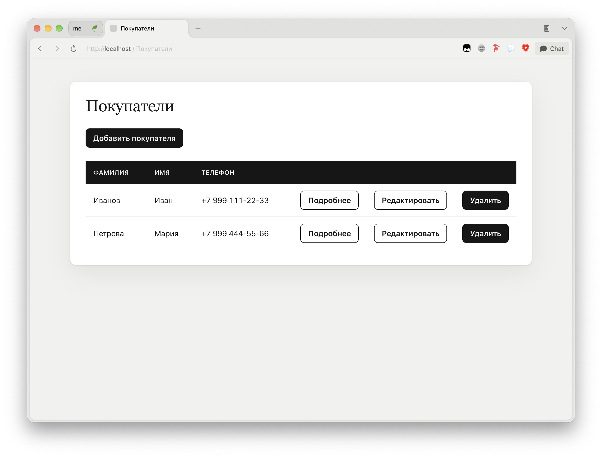
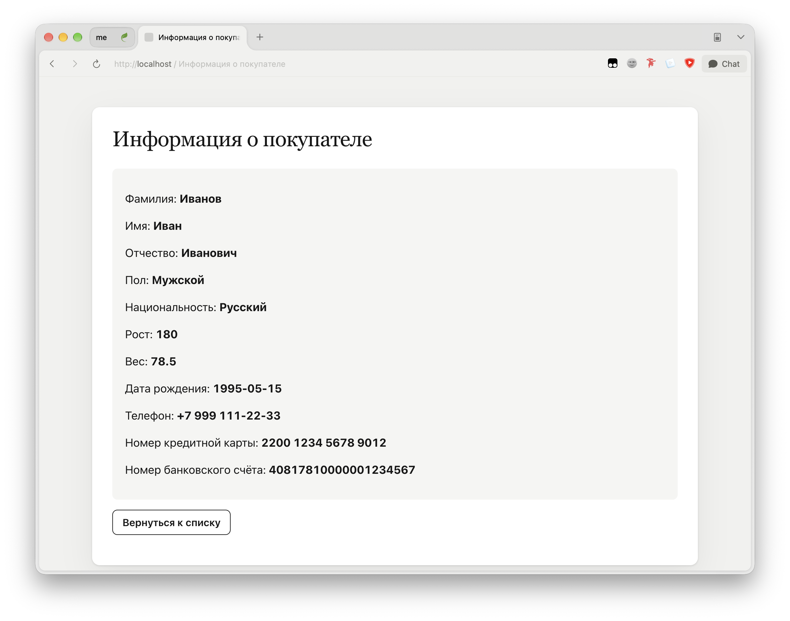
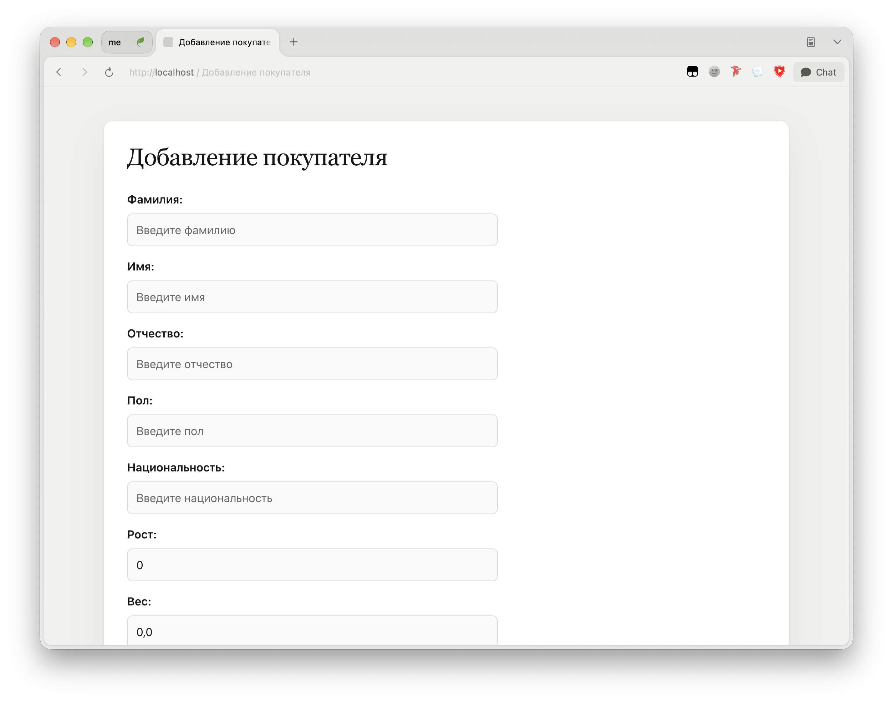
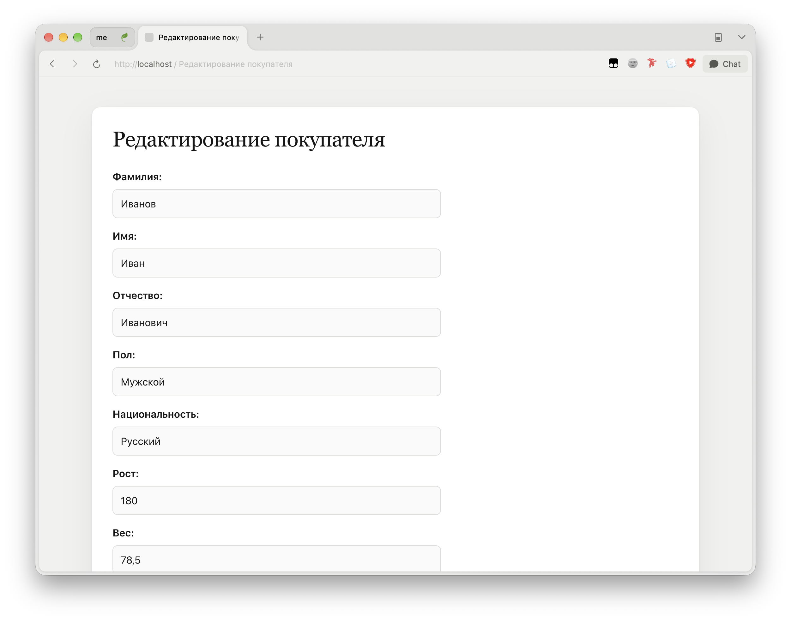

# Лабораторная работа №2

## Цель работы

Изучить работу Spring Data JPA на примере создания веб-приложения для управления данными о покупателях.

## Архитектура проекта

- **Стек:** Java 21, Spring Boot 4.1.1, Spring Web MVC, Spring Data JPA, Thymeleaf, H2 Database, Gradle, HTML, CSS.

### Основные компоненты

- **Entity — `Customer.java`**

  JPA-сущность описывает покупателя и хранит его фамилию, имя, отчество, пол, национальность, рост, вес, дату рождения, номер телефона, номер кредитной карты и номер банковского счёта.

- **Repository — `CustomerRepository.java`**

  Репозиторий наследуется от `CrudRepository` и предоставляет операции для получения, добавления, изменения и удаления покупателей в базе данных.

- **Controller — `CustomerController.java`**

  Контроллер обрабатывает GET- и POST-запросы, получает данные из репозитория и обеспечивает просмотр списка покупателей, вывод подробной информации, добавление, редактирование и удаление записей.

- **View — `customers.html`, `customer_details.html`, `add_customer.html` и `edit_customer.html`**

  HTML-шаблоны Thymeleaf отвечают за отображение списка покупателей, подробной информации, формы добавления и формы редактирования данных.

- **База данных — H2 Database и `data.sql`**

  Встроенная база данных H2 хранит сведения о покупателях в памяти, а файл `data.sql` заполняет таблицу начальными данными при запуске приложения.

- **Оформление — `style.css`**

  Таблица стилей отвечает за расположение элементов, оформление таблицы, форм, полей ввода и кнопок, а также адаптацию интерфейса для мобильных устройств.

### Структура проекта

```text
src/
├── main/
│   ├── java/
│   │   └── ru/kafpin/lab2/
│   │       ├── Lab2Application.java
│   │       ├── controller/
│   │       │   └── CustomerController.java
│   │       ├── entity/
│   │       │   └── Customer.java
│   │       └── repository/
│   │           └── CustomerRepository.java
│   └── resources/
│       ├── static/
│       │   └── css/
│       │       └── style.css
│       ├── templates/
│       │   ├── add_customer.html
│       │   ├── customer_details.html
│       │   ├── customers.html
│       │   └── edit_customer.html
│       ├── application.properties
│       └── data.sql
└── test/
    └── java/
        └── ru/kafpin/lab2/
            └── Lab2ApplicationTests.java
```

## Скриншоты работы приложения

### Список покупателей



### Информация о покупателе



### Добавление покупателя



### Редактирование покупателя

